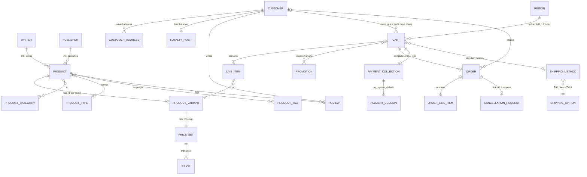

# Book Worm — Data model

Designed from the wireframes (`docs/wireframes/01–05`), the architecture diagram
(`docs/architecture.png`, deck slide 6) and the frontend domain types (`src/features/*/types.ts`).
The backend is **Medusa v2 on PostgreSQL** (plan `docs/plans/14-backend-medusa.md`): most entities
are Medusa's built-in commerce modules; four small custom modules cover what Medusa doesn't ship.

Legend: **core** = Medusa commerce module (no code, configured by the seed script);
**custom** = module in `backend/src/modules/*`; **link** = Medusa module link (a join table managed by Medusa).

## Entity relationship diagram

## Entities

### Catalog — core Product, Pricing, Region modules
| Wireframe / UI | Medusa field | Notes |
|---|---|---|
| Title, subtitle, description | `product.title`, `product.subtitle`, `product.description` | |
| URL slug (`/books/:handle`) | `product.handle` | unique |
| Front cover / back cover | `product.thumbnail`, `product.images[0..1]` | back cover optional (S3) |
| Format: Paperback / Hardcover / eBook | `product.type` (`product_type.value`) | native `type_id` filter in `GET /store/products` |
| Language | `product.tags` (`language:english`, `language:hindi`) | native `tag_id` filter |
| Categories (sidebar genres + Fiction / Non-fiction / Thriller / Horror) | `product_category` (handle, name) | many-to-many; the first category is the breadcrumb's top level |
| Price `₹149` | variant price in the **INR** region (`calculated_price`) | prices stored in rupees |
| Rating (stars) | computed from approved `review.rating`, fallback `product.metadata.rating` | |
| "145 copies sold" | `product.metadata.sold_count` (seed), plus order quantities | used for "Bestsellers this Month" |
| Delivery by Mon, 21 Jul | — | SIMULATED on the frontend: order date + 3 business days, eBook = Instant |
| `variantId` (add to cart) | `product_variant.id` | one variant per book |
| eBook needs no delivery | product has **no shipping profile** | Medusa then skips shipping for that line |

### Brands — custom `brands` module
| Model | Fields | Links |
|---|---|---|
| `writer` | `id`, `slug` (unique), `name`, `bio` (text[]: one per paragraph), `avatar_url` | `writer` ↔ `product` (one writer per book) |
| `publisher` | `id`, `slug` (unique), `name`, `description` | `publisher` ↔ `product` (one publisher per book) |

### Member — core Customer + Auth modules
| UI | Medusa field |
|---|---|
| First / last name, e-mail | `customer.first_name`, `last_name`, `email` |
| Login (e-mail + password) | auth identity, provider `emailpass` |
| "Use Saved Address" (S4) | `customer_address` (default shipping) — fields below |

Address mapping (S4 form → Medusa address): First Name → `first_name`, Last Name → `last_name`,
Address → `address_1`, City → `city`, Pin → `postal_code`, Code + Phone Number → `phone`
(`+91 9876543210`), State → `province`, Country → `country_code` (`in`, `np`, `bt`, `lk`),
e-mail → `cart.email`.

### Loyalty — custom `loyalty` module (gift points)
| Model | Fields | Rules |
|---|---|---|
| `loyalty_point` | `id`, `customer_id` (unique), `points` (int ≥ 0) | earn **1 point per ₹10** of the order total (subscriber on `order.placed`); redeem **1 point = ₹1**, capped at **50 %** of the subtotal; guests earn nothing |

Redemption follows Medusa's [loyalty points tutorial](https://docs.medusajs.com/resources/how-to-tutorials/tutorials/loyalty-points):
a single-use, customer-restricted **promotion** is created and applied to the cart; its id is kept in
`cart.metadata.loyalty_promo_id`.

### Reviews — custom `productReview` module
Based on Medusa's [product reviews tutorial](https://docs.medusajs.com/resources/how-to-tutorials/tutorials/product-reviews).
| Field | Type | Rules |
|---|---|---|
| `id` | id | |
| `product_id` | text, indexed | link to product |
| `customer_id` | text, nullable | link to customer |
| `first_name`, `last_name` | text | shown as the reviewer name |
| `content` | text | 1–100 characters (S3 "0/100" counter) |
| `rating` | int | 1–5 (DB check constraint) |
| `status` | enum `pending` / `approved` / `rejected` | see open question in plan 14 |

### Order — core Cart, Order, Promotion modules
| UI | Medusa |
|---|---|
| Basket lines, quantity stepper (max 10) | `cart.items` (`line_item.quantity`) |
| Coupons BOOKWORM100 / READMORE10 | `promotion` (code); BOOKWORM100 = fixed ₹100 with rule `item_subtotal gte 300` (rule created by the seed script, not available in the Admin UI); READMORE10 = 10 %. A code whose rule doesn't match is skipped silently by Medusa; the frontend checks and explains it |
| Price (n items), Tax, Delivery, Discount, Total | `cart.item_subtotal`, `tax_total` (12 % GST on the amount **after** discounts), `shipping_total`, `discount_total − discount_tax_total` (shown before tax), `total` |
| Order #1003 | `order.display_id` |
| Status "Placed" / "Cancellation requested" | `order.status` + an open `cancellation_request` |
| Points earned | from the loyalty subscriber, returned with the order (`order.metadata.points_earned`) |

### Cancellation — custom `cancellation` module
| Model | Fields | Rules |
|---|---|---|
| `cancellation_request` | `id`, `order_id` (unique), `customer_id`, `status` (`requested` / `approved` / `rejected`), `created_at` | only the order's customer; only while `now − order.created_at < 48 h`; the store confirms it in Medusa Admin (never shown as "Cancelled" until then) |

### Payment and Shipping — core modules
- **Payment**: provider `pp_system_default` (manual). Card / UPI / Wallet is chosen in the UI and validated there; **no card data is sent or stored**. The chosen method is stored as `order.metadata.payment_method`.
- **Shipping**: one stock location and one **calculated** shipping option "Standard delivery", priced by the custom fulfillment provider `bookworm-delivery` (`backend/apps/backend/src/modules/bookworm-delivery`): ₹40, or ₹0 when the items subtotal **before discounts** is at least ₹499. A hook (`src/workflows/hooks/shipping-pricing-context.ts`) passes `item_subtotal` to the provider; Medusa re-prices the method on every cart change. Delivery is GST-exempt (0 % tax-rate rule on the shipping option). **Resolved in Phase 3:** a flat-rate price rule can't do this (when a method is added, flat prices are calculated without `item_subtotal`), hence the calculated option above.

## Not stored on the server (SIMULATED, browser only)
- Wishlist (`localStorage`), as decided in plan 14.
- Delivery estimate (computed).
- Card / UPI / Wallet details.
